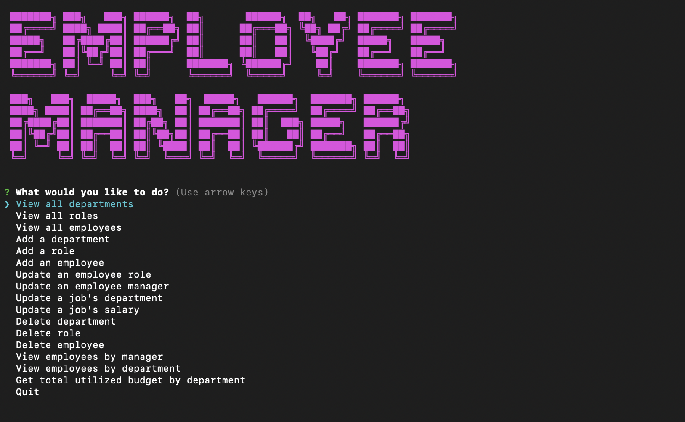

# Employee-Tracker
  

  ## Description
  
  Employee tracker is a command line interface program that allows buisness owners to access and manipulate data reguarding their buisness. Mainly, the program is designed to interact with 3 tables from a given mysql database: 'department', 'role', and 'employee'. These three tables are linked and work together to sort and store data.

  Users have the ability to view, add, update and delete data, as well as filter through the data to view specific results, such as 'list employees by department.'
  
  [Click here to view a video walkthrough](https://drive.google.com/file/d/1NOyErjZeRhpEygjvaiy0Z30r7M_hdUac/view)

  ## Table of Contents
    
  * [Installation](#installation)

  * [Usage](#usage)

  * [License](#license)

  * [Credits](#credits)

  * [Questions](#questions)
  
  ## Installation

  Requirements:
  * Node  
  * MySQL

  Given that users have mysql it is necessary to create a database. To accomplish this utilize the cli and navigate the root directory of the repo and initiate the mysql shell. Once inside the mysql shell run the command:

  ```
  source db/schema.sql
  ```

  Next, it is necessary to update the connection.js file in order to connect to the proper database. Simply update the value of host, user and password to your local values.

  Lastly, users must also run the following command from the root directory of the repo in the cli to install all dependencies:

  ```
  npm i
  ```
  
  ## Usage

  In order to initiate the program run the following command from the root directory of the repo:

  ```
  node index.js
  ```

  Users must utilize the arrow keys to select an action. Depending on the action users may be prompteded to answer a series of question before anything happens. For instance upon adding an employee the user must enter the employee's first name, then last name, then their job title and then their manager before the employee is officially added to the database. 

  

  All prompts are self explanatory and all inputs involve validation making it quite hard to break the program. If you enter an empty string as a name or a string as a salary, the program will inform you and you can correct the mistake immediately.

  ## License

  This project is licensed under the MIT license.

  ## Credits

  * [Node](https://nodejs.org/en/) The program utilizes Node for the ability to run javascript from the cli as well as the ability to utilize 3rd party packages credited below.

  * [MySQL](https://www.mysql.com/) The program utilizes MySQL in order to implement persistent data.

  * [mysql2 Node package](https://www.npmjs.com/package/mysql2) The program utilizes the mysql2 package in order for javascript to easily interact with MySQL databases stored on a users local device.
 
  * [Inquirer Node package](https://www.npmjs.com/package/inquirer) The program utilizes the inquirer package to easily prompt questions to the user and retrieve inputs through the cli.

  * [console.table Node package](https://www.npmjs.com/package/console.table) The program utilizes the console.table package to neatly print out table data in the cli.

  * [Cfonts Node package](https://www.npmjs.com/package/cfonts) The program utilizes the cfonts package in order to display the inital message 'Employee Manager' in a large bold font when the program starts. 

  ## Questions

  If you have any questions about the repo, open an issue or contact me directly at ddsmm.managlia@gmail.com. You can find more of my work at [dmanaglia](https://www.github.com/dmanaglia).
  